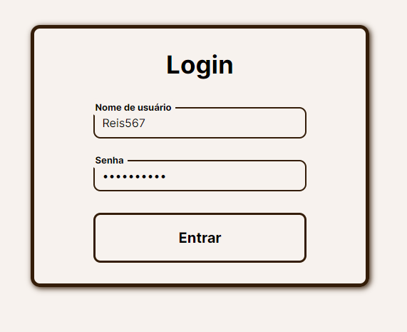

# Pycommerce - By Reis567

English version at the end 


Este é um projeto de uma plataforma de comércio eletrônico desenvolvida em Django. O projeto é destinado a permitir que os usuários comprem produtos, adicionem produtos aos favoritos, realizem pedidos, e tenham uma experiência de compra agradável.


## Conteúdo do Projeto

Explicação breve sobre os principais componentes do projeto:

### 1. Configuração do Ambiente

Antes de iniciar o projeto, certifique-se de ter configurado seu ambiente de desenvolvimento Python. Você pode usar o Docker para facilitar a configuração. Certifique-se de instalar todas as dependências listadas no `requirements.txt`. 

```bash
docker-compose build
docker-compose up
```

### 2. Estrutura de Diretórios

Explicação sobre a estrutura de diretórios do projeto:

- `djangoapp/`: O aplicativo principal contendo a lógica de negócios.
- `passreset/`: Aplicativo de recuperação de senha.
- `store/`: Aplicativo de e-commerce.
- `data/`: Armazenamento de dados (banco de dados, arquivos estáticos e de mídia).
- `scripts/`: Scripts auxiliares.
- `dotenv_files/`: Arquivos de configuração com variáveis de ambiente.

### 3. Configuração do Banco de Dados

O projeto usa o PostgreSQL como banco de dados. Certifique-se de configurar o arquivo `.env` com as informações corretas do banco de dados, como nome, usuário e senha. Você pode usar o seguinte comando para aplicar as migrações:

```bash
docker-compose run djangoapp python manage.py migrate
```

### 4. URLs

O projeto possui as seguintes URLs:

- `/`: Página inicial do comércio eletrônico.
- `/produto/<int:pk>/`: Página de detalhes do produto.
- `/cart/`: Carrinho de compras.
- `/checkout/`: Página de checkout.
- `/pedidos/`: Lista de pedidos.
- `/pedido/<int:id>/`: Detalhes de um pedido específico.
- `/login/`: Página de login.
- `/register/`: Página de registro de usuário.
- `/add_favorito/`: Adicionar um produto aos favoritos.
- `/remove_favorito/`: Remover um produto dos favoritos.
- `/favoritos/`: Lista de produtos favoritos.

### 5. Modelos

O projeto possui vários modelos de dados para lidar com informações de usuários, produtos, pedidos e favoritos. Consulte o arquivo `models.py` dentro do aplicativo `store` para obter detalhes sobre a estrutura do banco de dados.

### 6. Visualizações

As visualizações são definidas no aplicativo `store` e controlam a lógica de como as páginas são renderizadas e como os dados são manipulados.

- `home`: Visualização da página inicial com a lista de produtos.
- `ProdutoDetailView`: Visualização para mostrar detalhes de um produto específico.
- `cart`: Visualização do carrinho de compras.
- `checkout`: Visualização da página de checkout.
- `updateItem`: Visualização para atualizar o carrinho de compras.
- `processOrder`: Visualização para processar pedidos.
- `lista_pedidos`: Visualização para listar os pedidos de um usuário.
- `detalhes_pedido`: Visualização para detalhes de um pedido específico.
- `register`: Visualização para registro de usuários.
- `CustomLoginView`: Visualização de login personalizada.
- `add_favorito` e `remove_favorito`: Visualizações para adicionar ou remover produtos dos favoritos.
- `FavoriteListView`: Visualização para listar produtos favoritos.

### 7. Utils

O arquivo `utils.py` contém funções úteis, como a função `cookieCart` usada para gerenciar o carrinho de compras, mesmo para usuários não autenticados.

### 8. Frontend

O frontend é desenvolvido com HTML, CSS e JavaScript. O arquivo `cart.js` gerencia a interação do usuário com o carrinho de compras, permitindo a atualização do carrinho sem recarregar a página. 

### 9. URLs de Recuperação de Senha

O aplicativo `passreset` fornece URLs para recuperação de senha. 

- `/reset_password/`: Iniciar o processo de recuperação de senha.
- `/reset_password_sent/`: Confirmação de que um e-mail foi enviado para redefinir a senha.
- `/reset/<uidb64>/<token>`: URL exclusiva para confirmar a redefinição de senha.
- `/reset_password_complete/`: Confirmação de que a senha foi redefinida com sucesso.

## Executando o Projeto

Para executar o projeto, siga as etapas a seguir:

1. Configure seu ambiente.
2. Configure o banco de dados.
3. Execute o projeto.

Certifique-se de ler a documentação oficial do Django para obter mais detalhes sobre as funcionalidades do framework.

## Colaboração

Este é um projeto de código aberto, e você é incentivado a contribuir, enviar problemas ou solicitar novos recursos. Sinta-se à vontade para fazer um fork deste repositório e começar a trabalhar.

## Desktop




## Mobile
<div style='display:flex;'>
    
    
    
</div>


## English 


# Pycommerce - By Reis567

This is a Django-based e-commerce platform project designed to allow users to shop for products, add products to their favorites, place orders, and have a pleasant shopping experience.


## Project Content

Brief explanation of the project's key components:

### 1. Environment Setup

Before getting started with the project, make sure you have set up your Python development environment. You can use Docker to streamline the setup. Ensure you install all the dependencies listed in the `requirements.txt`.

```bash
docker-compose build
docker-compose up
```

### 2. Directory Structure

Explanation of the project's directory structure:

- `djangoapp/`: The main application containing the business logic.
- `passreset/`: Password reset application.
- `store/`: E-commerce application.
- `data/`: Data storage (database, static files, and media).
- `scripts/`: Helper scripts.
- `dotenv_files/`: Configuration files with environment variables.

### 3. Database Configuration

The project uses PostgreSQL as its database. Make sure to configure the `.env` file with the correct database information such as name, username, and password. You can apply the migrations using the following command:

```bash
docker-compose run djangoapp python manage.py migrate
```

### 4. URLs

The project has the following URLs:

- `/`: E-commerce homepage.
- `/produto/<int:pk>/`: Product detail page.
- `/cart/`: Shopping cart.
- `/checkout/`: Checkout page.
- `/pedidos/`: List of orders.
- `/pedido/<int:id>/`: Specific order details.
- `/login/`: Login page.
- `/register/`: User registration page.
- `/add_favorito/`: Add a product to favorites.
- `/remove_favorito/`: Remove a product from favorites.
- `/favoritos/`: List of favorite products.

### 5. Models

The project includes various data models to handle user information, products, orders, and favorites. Refer to the `models.py` file inside the `store` app for details on the database structure.

### 6. Views

Views are defined within the `store` app and control how pages are rendered and how data is handled.

- `home`: Homepage view displaying the product list.
- `ProdutoDetailView`: View for displaying details of a specific product.
- `cart`: Shopping cart view.
- `checkout`: Checkout page view.
- `updateItem`: View for updating the shopping cart.
- `processOrder`: View for processing orders.
- `lista_pedidos`: View for listing a user's orders.
- `detalhes_pedido`: View for details of a specific order.
- `register`: View for user registration.
- `CustomLoginView`: Custom login view.
- `add_favorito` and `remove_favorito`: Views for adding or removing products from favorites.
- `FavoriteListView`: View for listing favorite products.

### 7. Utils

The `utils.py` file contains useful functions, such as the `cookieCart` function used to manage the shopping cart, even for unauthenticated users.

### 8. Frontend

The frontend is developed using HTML, CSS, and JavaScript. The `cart.js` file manages user interaction with the shopping cart, allowing cart updates without page reload.

### 9. Password Reset URLs

The `passreset` app provides URLs for password reset.

- `/reset_password/`: Initiate the password reset process.
- `/reset_password_sent/`: Confirmation that an email has been sent to reset the password.
- `/reset/<uidb64>/<token>`: Unique URL for confirming password reset.
- `/reset_password_complete/`: Confirmation that the password has been successfully reset.

## Running the Project

To run the project, follow the steps below:

1. Set up your environment.
2. Configure the database.
3. Run the project.

Be sure to read the official Django documentation for more details on the framework's features.

## Collaboration

This is an open-source project, and you are encouraged to contribute, submit issues, or request new features. Feel free to fork this repository and start working.

## Desktop


## Mobile
<div style='display:flex;'>
    
    
    
</div>
